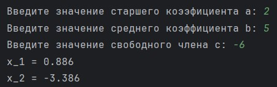
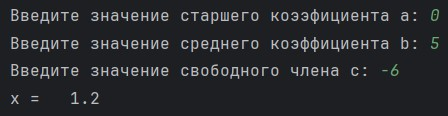
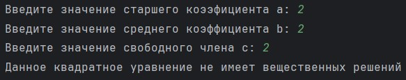
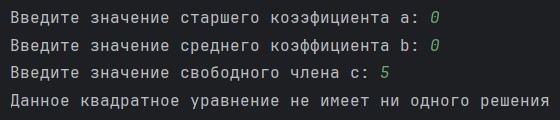

# Лабораторная работа №2. Квадратное уравнение

> Написать программу для решения квадратного уравнения по заданным коэффициентам a, b и c.

## Информация о работе
> - **Вариант:** общий
> - **Язык программирования:** Python
> - **Среда разработки:** Pycharm Community Edition

## Описание работы
> - [main.py](https://github.com/Kori-Tamashi/bmstu/blob/first_semester/first_semester/programming/lab_02/code/main.py) — файл программы
> - [solving_algorithm.png](https://github.com/Kori-Tamashi/bmstu/blob/first_semester/first_semester/programming/lab_02/design/solving_algorithm.png) — схема алгоритма решения квадратного уравнения
> - [solving_algorithm.drawio](https://github.com/Kori-Tamashi/bmstu/blob/first_semester/first_semester/programming/lab_02/design/solving_algorithm.drawio) — исходный файл Draw.io схемы алгоритма решения квадратного уравнения

### Последовательность выполнения

> Программа начинается с ввода коэффициентов *a*, *b* и *c* от пользователя, которые преобразуются в тип `float`. Далее программа проверяет, равен ли коэффициент *a* нулю. Если *a* равно нулю, она переходит к следующей проверке: если *b* также равно нулю, программа проверяет значение *c*. Если *c* равно нулю, выводится сообщение о том, что *x* может принимать любое значение. Если *c* не равно нулю, выводится сообщение о том, что уравнение не имеет решений. Если *b* не равно нулю, программа решает линейное уравнение, вычисляя *x* по формуле `-c / b` и выводя результат. Если *a* не равно нулю, программа вычисляет дискриминант по формуле `b ** 2 - 4 * a * c`. В зависимости от значения дискриминанта программа выполняет следующие действия: если дискриминант положителен, вычисляются два корня уравнения *x_1* и *x_2*, которые затем выводятся; если дискриминант равен нулю, вычисляется единственный корень *x*, который выводится; если дискриминант отрицателен, программа сообщает, что уравнение не имеет вещественных решений.

### Особенности выполнения

#### Незащищенный ввод

> В коде отсутствует обработка исключений при вводе значений коэффициентов. Если пользователь введет символ или некорректное значение (например, буквы или специальные символы), программа вызовет ошибку и остановится. Для улучшения кода можно добавить обработку исключений с использованием конструкции [try-except](https://metanit.com/python/tutorial/2.11.php), чтобы избежать аварийного завершения программы и обеспечить более удобный ввод для пользователя. Это позволит программе продолжать запрашивать ввод до тех пор, пока не будет введено корректное значение.

#### F-строки

> В коде используются [f-строки](https://sky.pro/wiki/python/formatirovanie-strok-v-python-f-string/) для форматирования вывода значений корней квадратного уравнения. Это позволяет удобно и наглядно вставлять значения переменных в строки, обеспечивая читаемость и легкость в использовании. F-строки поддерживают форматирование, что позволяет задать количество знаков после запятой, что делает вывод более аккуратным и понятным для пользователя.

### Примеры работы

|           2 решения           |           1 решение           |
|:-----------------------------:|:-----------------------------:|
|  |  |
|   **Нет вещественных решений**    |          **Нет решений**          |
|  |  |