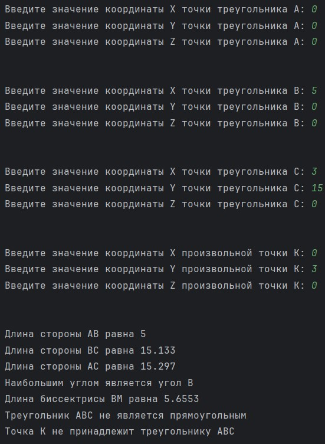
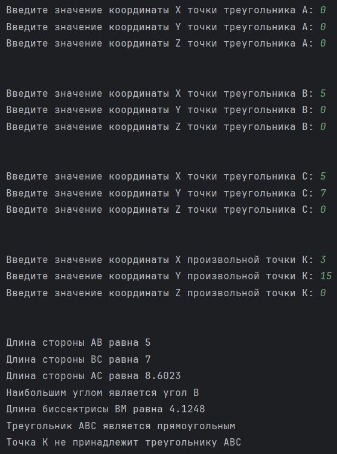
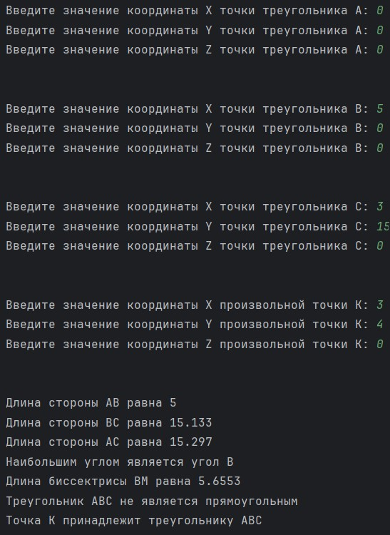
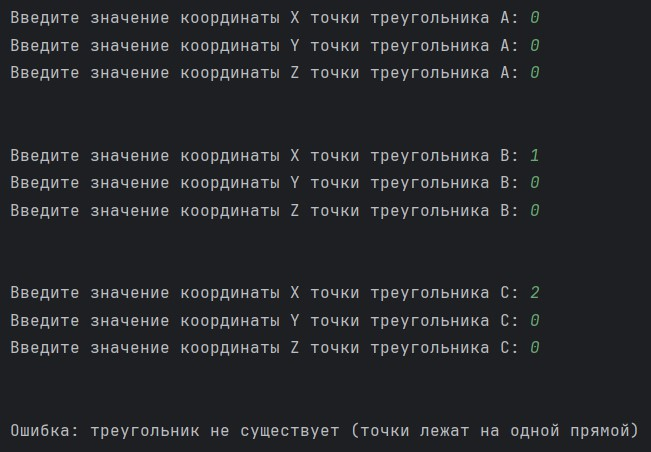

# Лабораторная работа №3. Треугольник

> Научиться создавать более сложные программы и правильно работать с вещественной арифметикой.

## Информация о работе
> - **Вариант:** написать программу вычисления длин сторон треугольника и длины его биссектрисы, проведенной из наибольшего угла, проверки является ли данный треугольник прямоугольным, а также для определения принадлежности произвольной точки к этому треугольнику
> - **Язык программирования:** Python
> - **Среда разработки:** Pycharm Community Edition

## Описание работы
> - [main.py](https://github.com/Kori-Tamashi/bmstu/blob/first_semester/first_semester/programming/lab_03/code/main.py) — файл программы
> - [lab_03.pdf](https://github.com/Kori-Tamashi/bmstu/blob/first_semester/first_semester/programming/lab_03/documents/lab_03.pdf) — файл с заданием лабораторной работы

### Последовательность выполнения

> Программа начинается с ввода координат трех точек треугольника A, B и C в трехмерном пространстве, запрашивая у пользователя значение каждой координаты (X, Y и Z) для каждой точки. Для каждого ввода реализован цикл, который повторяется до тех пор, пока пользователь не введет корректное вещественное число. В случае ввода некорректного значения программа выводит сообщение об ошибке и повторяет запрос. После ввода координат программа вычисляет векторы AB, AC и BC, представляющие стороны треугольника, вычитая координаты соответствующих точек. Далее следует проверка существования треугольника, которая осуществляется с помощью вычисления определителя, основанного на векторах AB и AC. Определитель рассчитывается по формуле, которая учитывает компоненты векторов, и его значение показывает, являются ли три точки коллинеарными. Если определитель близок к нулю (т.е. его абсолютное значение меньше заданного значения EPS, равного 1e-8), это означает, что точки A, B и C лежат на одной прямой, и, следовательно, треугольник не может существовать. В этом случае программа выводит сообщение об ошибке и завершает выполнение. Если определитель не равен нулю, программа продолжает выполнение и вычисляет длины сторон треугольника, используя формулу для расстояния между двумя точками в трехмерном пространстве. После этого происходит проверка, является ли треугольник прямоугольным, путем сравнения квадратов длин сторон, и программа находит длину биссектрисы угла, противолежащего наибольшей стороне. Затем программа запрашивает у пользователя координаты произвольной точки K и проверяет, принадлежит ли эта точка треугольнику, вычисляя векторы от каждой вершины треугольника до точки K и используя векторное произведение для определения положения точки относительно треугольника. В конце программа выводит результаты, включая длины сторон треугольника, информацию о наибольшем угле, длину биссектрисы, а также сообщения о том, является ли треугольник прямоугольным и принадлежит ли точка K треугольнику ABC.

### Особенности выполнения

#### Равенство вещественных чисел

> Вещественные числа не всегда могут быть точно представлены в двоичной системе, что может приводить к [ошибкам округления](https://ru.stackoverflow.com/questions/887818/%D0%9A%D0%B0%D0%BA-%D0%BF%D1%80%D0%BE%D0%B2%D0%B5%D1%80%D0%B8%D1%82%D1%8C-%D0%BD%D0%B0-%D1%80%D0%B0%D0%B2%D0%BD%D0%BE%D1%81%D1%82%D1%8C-%D0%B4%D0%B2%D0%B0-%D0%B2%D0%B5%D1%89%D0%B5%D1%81%D1%82%D0%B2%D0%B5%D0%BD%D0%BD%D1%8B%D1%85-%D1%87%D0%B8%D1%81%D0%BB%D0%B0-%D0%B2-%D1%8F%D0%B7%D1%8B%D0%BA%D0%B5-%D0%A1%D0%B8). Поэтому простое сравнение двух вещественных чисел с помощью оператора `==` может не сработать, если числа кажутся одинаковыми, но имеют небольшие различия на уровне машинных вычислений. Чтобы избежать проблем с точным сравнением, используется подход с заданной точностью: вместо того чтобы проверять равенство напрямую, проверяется, находится ли абсолютное значение разности чисел в пределах некоторого небольшого положительного значения, называемого epsilon (или eps).

#### Проверка существования треугольника

> Проверка существования треугольника на основе векторного произведения и коллинеарности осуществляется с помощью анализа векторов, образованных из координат его вершин. Для начала, из координат трех точек A, B и C вычисляются два вектора: вектор AB, который направлен от точки A к точке B, и вектор AC, направленный от точки A к точке C. Эти векторы вычисляются как разности координат: вектор AB имеет компоненты (x_B - x_A, y_B - y_A, z_B - z_A), а вектор AC — (x_C - x_A, y_C - y_A, z_C - z_A). Далее, для проверки коллинеарности векторов AB и AC используется детерминант, который позволяет установить, являются ли эти векторы линейно зависимыми. В данном контексте, если векторы коллинеарны, это означает, что все три точки A, B и C лежат на одной прямой, и треугольник не может существовать. Детерминант вычисляется по формуле, которая включает в себя произведения координат векторов, и если его абсолютное значение оказывается меньше заранее заданного значения EPS (погрешности), то это указывает на то, что треугольник не существует, так как точки коллинеарны. В противном случае, если детерминант не равен нулю, это подтверждает, что точки A, B и C образуют треугольник, так как они не лежат на одной прямой. 

#### Проверка принадлежности произвольной точки треугольнику

> Логика проверки принадлежности произвольной точки K треугольнику ABC основывается на использовании векторного анализа, в частности, на вычислении векторных произведений. Сначала необходимо определить векторы, соединяющие вершины треугольника с точкой K. Для этого вычисляются векторы AK, BK и CK, которые представляют собой направления от каждой из вершин треугольника к точке K. Затем вычисляются векторные произведения для пар векторов: вектор AB (от A к B) и вектор AK, вектор BC (от B к C) и вектор BK, а также вектор CA (от C к A) и вектор CK. Векторное произведение двух векторов дает вектор, перпендикулярный плоскости, образованной этими векторами. Знак этого произведения указывает на то, с какой стороны от первого вектора находится второй. После вычисления векторных произведений cp_AB_AK, cp_BC_BK и cp_CA_CK необходимо проанализировать их знаки. Если все три произведения имеют одинаковый знак (все положительные или все отрицательные), это означает, что точка K находится внутри треугольника ABC. Если хотя бы одно из произведений имеет противоположный знак, это указывает на то, что точка K находится вне треугольника или на его границе. Таким образом, алгоритм проверки принадлежности точки K к треугольнику ABC основывается на сравнении знаков векторных произведений, что позволяет определить, с какой стороны от каждой стороны треугольника находится точка K, и тем самым установить ее принадлежность к треугольнику.

#### Длина биссектрисы

> Длина биссектрисы может быть расчитана с использованием [теоремы Стюарта](https://ru.wikipedia.org/wiki/%D0%91%D0%B8%D1%81%D1%81%D0%B5%D0%BA%D1%82%D1%80%D0%B8%D1%81%D0%B0): $L = \frac{2\sqrt{abp(p - c)}}{a + b}$.

#### Функция exit

> Функция `exit()` в Python [используется](https://sky.pro/media/raznicza-mezhdu-exit-i-sys-exit-v-python/) для завершения выполнения программы.

#### F-строки

> В коде используются [f-строки](https://sky.pro/wiki/python/formatirovanie-strok-v-python-f-string/) для форматирования вывода значений. Это позволяет удобно и наглядно вставлять значения переменных в строки, обеспечивая читаемость и легкость в использовании. F-строки поддерживают форматирование, что позволяет задать количество знаков после запятой, что делает вывод более аккуратным и понятным для пользователя.

### Примеры работы

| Произвольный треугольник и точка не принадлежит треугольнику | Прямоугольный треугольник и точка не принадлежит треугольнику |
|:------------------------------------------------------------:|:-------------------------------------------------------------:|
|                                 |                                  |
|  **Произвольный треугольник и точка принадлежит треугольнику**   |                **Несуществующий треугольник**                 |
|                                 |                              |

