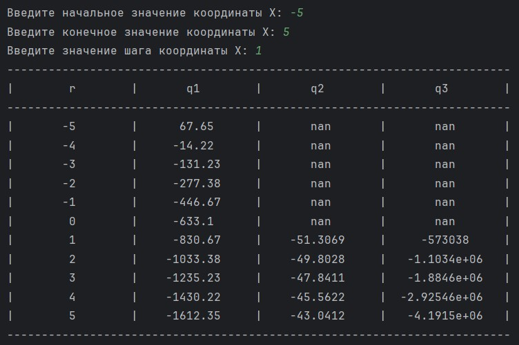
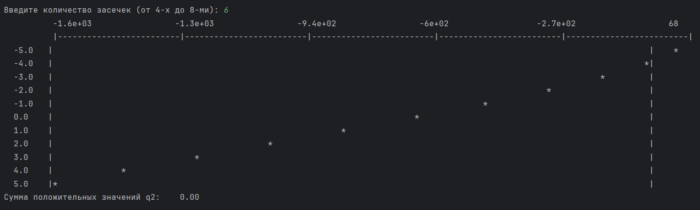

# Лабораторная работа №4. График

> Научиться использовать оператор цикла.

## Информация о работе
> - **Вариант:** оператор `for`, функции $q_1 = r^3 - 5.57r - 193r - 633.1$, $q_2 = r\log(r) - 52$, $q_3 = \frac{q^3_1 - q^3_2}{1000}$
> - **Язык программирования:** Python
> - **Среда разработки:** Pycharm Community Edition

## Описание работы
> - [main.py](https://github.com/Kori-Tamashi/bmstu/blob/first_semester/first_semester/programming/lab_04/code/main.py) — файл программы
> - [lab_04.pdf](https://github.com/Kori-Tamashi/bmstu/blob/first_semester/first_semester/programming/lab_04/documents/lab_04.pdf) — файл с заданием лабораторной работы

### Последовательность выполнения

> Программа начинается с ввода начального и конечного значений координаты X, а также шага координаты X, при этом обеспечивается обработка ошибок ввода. Затем выводится таблица значений трех функций: q1, q2 и q3, где для каждой точки X вычисляются значения функций, а также ищутся максимальные и минимальные значения функции q1 и сумма положительных значений функции q2. После этого программа запрашивает количество засечек для графика (от 4 до 8) и выводит ось Y с соответствующими значениями. Затем строится график функции q1, где для каждой точки X определяется позиция на графике в зависимости от значений функции. В конце выводится сумма положительных значений функции q2.

### Особенности выполнения

#### Выравнивание по ширине

> В коде определены две константы: table_width и graph_width, которые задают ширину таблицы значений и ширину графика функции соответственно. Константа table_width установлена равной 75, что определяет общий размер таблицы, в то время как graph_width равна 150, что задает размер графика функции q1. Эти значения можно изменять в зависимости от требований к отображению данных, например, увеличивая или уменьшая их для более удобного восприятия информации или для соответствия определенному формату вывода. Изменение этих констант позволит адаптировать внешний вид таблицы и графика под различные нужды пользователя.

#### F-строки

> В коде используются [f-строки](https://sky.pro/wiki/python/formatirovanie-strok-v-python-f-string/) для форматирования вывода значений корней квадратного уравнения. Это позволяет удобно и наглядно вставлять значения переменных в строки, обеспечивая читаемость и легкость в использовании. F-строки поддерживают форматирование, что позволяет задать количество знаков после запятой, что делает вывод более аккуратным и понятным для пользователя.

### Примеры работы

|         Вывод таблицы         |      Отображение графика      |
|:------------------------------|:-----------------------------:|
|  |  |