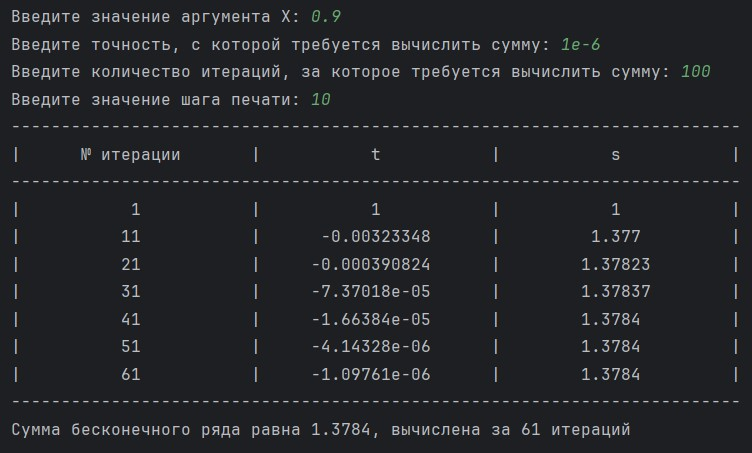
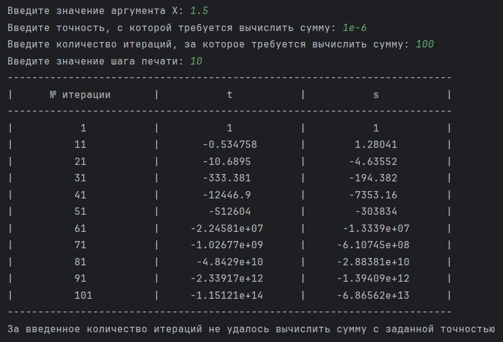

# Лабораторная работа №5. Сумма бесконечного ряда

> Составить программу вычисления суммы ряда (по варианту) с точностью до члена  ряда . Программа должна позволять задать значение аргумента $\epsilon$ (если требуется по варианту), точность, максимальное количество итераций и шаг печати. Необходимо вывести таблицу промежуточных вычислений с заданным шагом (номер итерации, значение текущего члена, промежуточное значение суммы) и результат - вычисленное значение суммы ряда либо сообщение о том, что за указанное число итераций необходимой точности достичь не удалось.

## Информация о работе
> - **Вариант:** сумма ряда $s = \overset{\infty}{\Sigma}(-1)^{n + 1}\frac{1 \cdot 3 \cdot \ldots \cdot (2n - 3)}{2 \cdot 4 \cdot \ldots \cdot 2n}x^n$
> - **Язык программирования:** Python
> - **Среда разработки:** Pycharm Community Edition

## Описание работы
> - [main.py](https://github.com/Kori-Tamashi/bmstu/blob/first_semester/first_semester/programming/lab_05/code/main.py) — файл программы
> - [lab_05.pdf](https://github.com/Kori-Tamashi/bmstu/blob/first_semester/first_semester/programming/lab_05/documents/lab_05.pdf) — файл с заданием лабораторной работы

### Последовательность выполнения

> Программа начинается с определения ширины таблицы значений, установленной на 75 символов. Затем происходит ввод значений от пользователя: сначала запрашивается значение аргумента X, с обработкой возможных ошибок ввода, чтобы убедиться, что введено вещественное числовое значение. После этого аналогично запрашивается точность eps, количество итераций n и шаг печати h, также с обработкой ошибок ввода. Далее программа формирует и выводит заголовок таблицы, включая разделитель, используя заданные параметры ширины столбцов. Затем инициализируются переменные для суммы s и последнего члена t_last, устанавливая их равными 1, и инициализируется счетчик для печати значений. В цикле выполняются итерации, где вычисляется текущий член ряда t_current, который добавляется к общей сумме s. Если абсолютное значение текущего члена меньше заданной точности eps, устанавливается флаг is_accurate и происходит выход из цикла. Если номер итерации совпадает с текущим значением счетчика, выводится строка с номером итерации, текущим членом и суммой. После завершения цикла выводится разделитель. В конце программа проверяет флаг is_accurate: если он установлен, выводится сумма ряда и количество итераций, за которые она была вычислена; если нет, выводится сообщение о том, что за введенное количество итераций не удалось достичь заданной точности.

### Особенности выполнения

#### Выравнивание по ширине

> Константа table_width в данной программе определяет ширину таблицы, используемой для форматирования вывода данных о сумме бесконечного ряда. Она устанавливает максимальную ширину строки таблицы и позволяет гибко настраивать отображение информации. Изменяя значение table_width, пользователь может легко адаптировать количество столбцов и длину данных, что упрощает визуализацию результатов. При изменении этой константы автоматически пересчитываются размеры столбцов и форматирование заголовков, что делает код более удобным и универсальным для различных требований. Таким образом, table_width обеспечивает возможность быстрого изменения внешнего вида таблицы без необходимости вносить изменения в другие части кода.

#### Вычисление суммы ряда

> В данной программе можно оптимизировать вычисление суммы бесконечного ряда, избегая необходимости пересчитывать каждый член ряда с нуля на каждой итерации. Вместо этого следует использовать уже вычисленный предыдущий член ряда для получения текущего. Это достигается путем вычисления разницы между текущим и предыдущим членами. В частности, текущий член `t_current` можно получить, умножив последний член `t_last` на определенный коэффициент, что позволяет избежать повторных вычислений. После этого текущий член просто добавляется к общей сумме `s`. Такой подход не только упрощает логику программы, но и значительно повышает ее производительность, так как уменьшает количество необходимых вычислений и делает код более эффективным. Таким образом, вместо того чтобы каждый раз заново пересчитывать текущий член ряда, мы лишь обновляем сумму, добавляя к ней разницу, что делает процесс вычисления более быстрым и экономичным.

#### Названия переменных

> - [*flt_inpt_err_msg*](https://github.com/Kori-Tamashi/bmstu/blob/first_semester/first_semester/programming/lab_05/code/main.py#L5) является сокращением от *float_input_error_message* (англ. сообщение об ошибке при вводе вещественного числа)
> - [*pint_inpt_err_msg*](https://github.com/Kori-Tamashi/bmstu/blob/first_semester/first_semester/programming/lab_05/code/main.py#L6) является сокращением от *positive_int_input_error_message* (англ. сообщение об ошибке при вводе натурального числа)

### Примеры работы

|       Рассчитанная сумма       |      Нерассчитанная сумма      |
|:-----------------------------:|:-----------------------------:|
|  |  |
