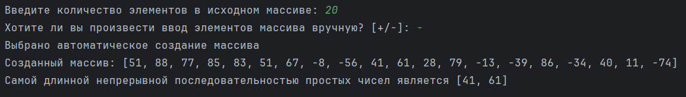

# Лабораторная работа №6. Списки (часть I)

> Написать 7 независимых программ (различных модулей - файлов исходного кода) для работы с целочисленными списками, каждая из которых будет реализовывать ввод, соответствующее задание и вывод изменённого списка (кроме пп. 3, 4):
> - (1a). Добавить элемент в заданное место списка (по индексу) с использованием любых средств Python
> - (1b). Добавить элемент в заданное место списка (по индексу) алгоритмически
> - (2a). Удалить элемент с заданным индексом с использованием любых средств Python
> - (2b). Удалить элемент с заданным индексом алгоритмически
> - (3). Найти значение K-го экстремума в списке
> - (4). Найти наиболее длинную непрерывную последовательность по варианту
> - (5). Поменять местами элементы с характеристиками по варианту

## Информация о работе
> - **Вариант:** 
>   - (4). Поиск в массиве самой длинной непрерывной последовательности простых чисел
>   - (5). Cмена местами последнего нулевого и максимального отрицательного элементов массива
> - **Язык программирования:** Python
> - **Среда разработки:** Pycharm Community Edition

## Описание работы

| Файл                                                                                                                           | Описание                       |
|:-------------------------------------------------------------------------------------------------------------------------------|:-------------------------------|
| [insert_a.py](https://github.com/Kori-Tamashi/bmstu/blob/first_semester/first_semester/programming/lab_06/code/insert_a.py)    | Программа 1a                   |
| [insert_b.py](https://github.com/Kori-Tamashi/bmstu/blob/first_semester/first_semester/programming/lab_06/code/insert_b.py)    | Программа 1b                   |
| [del_a.py](https://github.com/Kori-Tamashi/bmstu/blob/first_semester/first_semester/programming/lab_06/code/del_a.py)          | Программа 2a                   |
| [del_b.py](https://github.com/Kori-Tamashi/bmstu/blob/first_semester/first_semester/programming/lab_06/code/del_b.py)          | Программа 2b                   |
| [extremum.py](https://github.com/Kori-Tamashi/bmstu/blob/first_semester/first_semester/programming/lab_06/code/extremum.py)    | Программа 3                    |
| [sequence.py](https://github.com/Kori-Tamashi/bmstu/blob/first_semester/first_semester/programming/lab_06/code/sequence.py)    | Программа 4                    |
| [swap.py](https://github.com/Kori-Tamashi/bmstu/blob/first_semester/first_semester/programming/lab_06/code/swap.py)            | Программа 5                    |
| [config.py](https://github.com/Kori-Tamashi/bmstu/blob/first_semester/first_semester/programming/lab_06/code/config.py)        | Файл, содержащий константы     |

### Последовательность выполнения

#### Программа 1a

> Импортируются библиотеки random и config, затем начинается ввод количества элементов массива, где переменная n запрашивается в цикле до тех пор, пока пользователь не введет положительное целое число. Если ввод некорректен, выводится сообщение об ошибке, хранящееся в pint_inpt_err_msg. После успешного ввода переменной is_manual_input присваивается результат сравнения ввода пользователя с символом '+', что определяет, будет ли массив вводиться вручную или автоматически. Если выбрано ручное введение, выводится сообщение об этом, иначе сообщается о выборе автоматического создания массива. Массив arr инициализируется нулями длиной n. Если is_manual_input истинно, происходит цикл, в котором для каждого индекса массива запрашивается ввод элемента, который сохраняется в arr[i]. Если ввод некорректен, выводится сообщение об ошибке, хранящееся в int_inpt_err_msg. Если ручной ввод не выбран, массив заполняется случайными числами в диапазоне, определяемом переменными min_element и max_element. После создания массива выводится его содержимое. Далее запрашивается ввод элемента, который нужно добавить, и сохраняется в переменной m. Вводится индекс для добавления элемента, который хранится в переменной index, при этом проверяется, что он находится в диапазоне от 0 до n. Если ввод некорректен, выводится сообщение об ошибке, хранящееся в uint_inpt_err_msg. После успешного ввода элемент m добавляется в массив arr по индексу index с помощью метода insert. В завершение выводится обработанный массив, который теперь включает добавленный элемент.

#### Программа 1b

> Импортируются библиотеки random и config, затем начинается ввод количества элементов массива, где переменная n запрашивается в цикле до тех пор, пока пользователь не введет положительное целое число. Если ввод некорректен, выводится сообщение об ошибке, хранящееся в pint_inpt_err_msg. После успешного ввода переменной is_manual_input присваивается результат сравнения ввода пользователя с символом '+', что определяет, будет ли массив вводиться вручную или автоматически. Если выбрано ручное введение, выводится сообщение об этом, иначе сообщается о выборе автоматического создания массива. Массив arr инициализируется нулями длиной n. Если is_manual_input истинно, происходит цикл, в котором для каждого индекса массива запрашивается ввод элемента, который сохраняется в arr[i]. Если ввод некорректен, выводится сообщение об ошибке, хранящееся в int_inpt_err_msg. Если ручной ввод не выбран, массив заполняется случайными числами в диапазоне, определяемом переменными min_element и max_element. После создания массива выводится его содержимое. Далее запрашивается ввод элемента, который нужно добавить, и сохраняется в переменной m. Вводится индекс для добавления элемента, который хранится в переменной index, при этом проверяется, что он находится в диапазоне от 0 до n. Если ввод некорректен, выводится сообщение об ошибке, хранящееся в uint_inpt_err_msg. После успешного ввода массив arr увеличивается на один элемент с помощью метода append, добавляя элемент со значением 0. Затем происходит сдвиг элементов массива с индекса n до index вправо, копируя значения из предыдущих индексов. После этого в arr[index] сохраняется значение m. В завершение выводится обработанный массив, который теперь включает добавленный элемент.

#### Программа 2a

> Импортируются библиотеки random и config, затем начинается ввод количества элементов массива, где переменная n запрашивается в цикле до тех пор, пока пользователь не введет положительное целое число. Если ввод некорректен, выводится сообщение об ошибке, хранящееся в pint_inpt_err_msg. После успешного ввода переменной is_manual_input присваивается результат сравнения ввода пользователя с символом '+', что определяет, будет ли массив вводиться вручную или автоматически. Если выбрано ручное введение, выводится сообщение об этом, иначе сообщается о выборе автоматического создания массива. Массив arr инициализируется нулями длиной n. Если is_manual_input истинно, происходит цикл, в котором для каждого индекса массива запрашивается ввод элемента, который сохраняется в arr[i]. Если ввод некорректен, выводится сообщение об ошибке, хранящееся в int_inpt_err_msg. Если ручной ввод не выбран, массив заполняется случайными числами в диапазоне, определяемом переменными min_element и max_element. После создания массива выводится его содержимое. Далее вводится индекс для удаления элемента, который хранится в переменной index, при этом проверяется, что он находится в диапазоне от 0 до n - 1. Если ввод некорректен, выводится сообщение об ошибке, хранящееся в uint_inpt_err_msg. После успешного ввода элемент массива по индексу index удаляется с помощью оператора del. В завершение выводится обработанный массив, который теперь не включает удаленный элемент.

#### Программа 2b

> Импортируются библиотеки random и config, затем начинается ввод количества элементов массива, где переменная n запрашивается в цикле до тех пор, пока пользователь не введет положительное целое число. Если ввод некорректен, выводится сообщение об ошибке, хранящееся в pint_inpt_err_msg. После успешного ввода переменной is_manual_input присваивается результат сравнения ввода пользователя с символом '+', что определяет, будет ли массив вводиться вручную или автоматически. Если выбрано ручное введение, выводится сообщение об этом, иначе сообщается о выборе автоматического создания массива. Массив arr инициализируется нулями длиной n. Если is_manual_input истинно, происходит цикл, в котором для каждого индекса массива запрашивается ввод элемента, который сохраняется в arr[i]. Если ввод некорректен, выводится сообщение об ошибке, хранящееся в int_inpt_err_msg. Если ручной ввод не выбран, массив заполняется случайными числами в диапазоне, определяемом переменными min_element и max_element. После создания массива выводится его содержимое. Далее вводится индекс для удаления элемента, который хранится в переменной index, при этом проверяется, что он находится в диапазоне от 0 до n - 1. Если ввод некорректен, выводится сообщение об ошибке, хранящееся в uint_inpt_err_msg. После успешного ввода происходит алгоритмическое удаление элемента: в цикле элементы массива с индекса index сдвигаются влево, копируя значения из следующего индекса, а затем последний элемент массива удаляется с помощью оператора del. В завершение выводится обработанный массив, который теперь не включает удаленный элемент.

#### Программа 3

> Импортируются библиотеки random и config, затем начинается ввод количества элементов массива, где переменная n запрашивается в цикле до тех пор, пока пользователь не введет положительное целое число. Если ввод некорректен, выводится сообщение об ошибке, хранящееся в pint_inpt_err_msg. После успешного ввода переменной is_manual_input присваивается результат сравнения ввода пользователя с символом '+', что определяет, будет ли массив вводиться вручную или автоматически. Если выбрано ручное введение, выводится сообщение об этом, иначе сообщается о выборе автоматического создания массива. Массив arr инициализируется нулями длиной n. Если is_manual_input истинно, происходит цикл, в котором для каждого индекса массива запрашивается ввод элемента, который сохраняется в arr[i]. Если ввод некорректен, выводится сообщение об ошибке, хранящееся в int_inpt_err_msg. Если ручной ввод не выбран, массив заполняется случайными числами в диапазоне, определяемом переменными min_element и max_element. После создания массива выводится его содержимое. Далее происходит поиск экстремумов, которые сохраняются в списке extremums с помощью генератора списков, проверяющего условия для каждого элемента массива, кроме первого и последнего. Количество найденных экстремумов сохраняется в переменной e_count. Если e_count равно нулю, выводится сообщение о том, что в массиве отсутствуют экстремумы, и программа завершает работу. После этого запрашивается ввод номера экстремума, который хранится в переменной k, при этом проверяется, что он находится в диапазоне от 1 до e_count. Если ввод некорректен, выводится сообщение об ошибке, хранящееся в pint_inpt_err_msg. После успешного ввода выводится значение k-го экстремума из списка extremums.

#### Программа 4

> Импортируются библиотеки random и config, затем начинается ввод количества элементов массива, где переменная n запрашивается в цикле до тех пор, пока пользователь не введет положительное целое число. Если ввод некорректен, выводится сообщение об ошибке, хранящееся в pint_inpt_err_msg. После успешного ввода переменной is_manual_input присваивается результат сравнения ввода пользователя с символом '+', что определяет, будет ли массив вводиться вручную или автоматически. Если выбрано ручное введение, выводится сообщение об этом, иначе сообщается о выборе автоматического создания массива. Массив arr инициализируется нулями длиной n. Если is_manual_input истинно, происходит цикл, в котором для каждого индекса массива запрашивается ввод элемента, который сохраняется в arr[i]. Если ввод некорректен, выводится сообщение об ошибке, хранящееся в int_inpt_err_msg. Если ручной ввод не выбран, массив заполняется случайными числами в диапазоне, определяемом переменными min_element и max_element. После создания массива выводится его содержимое. Далее начинается поиск самой длинной непрерывной последовательности простых чисел, для чего инициализируются списки longest_sequence и current_sequence. В цикле перебираются элементы массива, и если элемент больше 1 и является простым числом (проверка осуществляется с помощью генератора, проверяющего делимость элемента на числа от 2 до квадратного корня из элемента), он добавляется в current_sequence. Если длина текущей последовательности превышает длину самой длинной последовательности, то longest_sequence обновляется копией current_sequence. Если элемент не является простым, current_sequence сбрасывается. После завершения перебора выводится результат: если longest_sequence не пуст, выводится ее содержимое, иначе выводится сообщение о том, что в массиве отсутствуют простые числа.

#### Программа 5

> Импортируются библиотеки random и config, затем начинается ввод количества элементов массива, где переменная n запрашивается в цикле до тех пор, пока пользователь не введет положительное целое число. Если ввод некорректен, выводится сообщение об ошибке, хранящееся в pint_inpt_err_msg. После успешного ввода переменной is_manual_input присваивается результат сравнения ввода пользователя с символом '+', что определяет, будет ли массив вводиться вручную или автоматически. Если выбрано ручное введение, выводится сообщение об этом, иначе сообщается о выборе автоматического создания массива. Массив arr инициализируется нулями длиной n. Если is_manual_input истинно, происходит цикл, в котором для каждого индекса массива запрашивается ввод элемента, который сохраняется в arr[i]. Если ввод некорректен, выводится сообщение об ошибке, хранящееся в int_inpt_err_msg. Если ручной ввод не выбран, массив заполняется случайными числами в диапазоне, определяемом переменными min_element и max_element. После создания массива выводится его содержимое. Далее начинается обработка массива, где инициализируются переменные null_index и max_negative_index значением -1, а также переменная max_negative значением отрицательной бесконечности. В цикле перебираются элементы массива, и если элемент равен 0, обновляется null_index. Если элемент отрицательный и больше текущего максимального отрицательного, то обновляются значения max_negative и max_negative_index. После завершения цикла элементы массива на позициях null_index и max_negative_index меняются местами. В конце выводится результат: если оба индекса не равны -1, выводится обработанный массив; если оба индекса равны -1, выводится сообщение о том, что все элементы положительные; если null_index равен -1, выводится сообщение о том, что среди элементов нет нулевого; если max_negative_index равен -1, выводится сообщение о том, что среди элементов нет отрицательного.

### Особенности выполнения

#### Файл с константами

> Программа использует файл config.py для хранения констант, что позволяет централизовать настройки и упростить редактирование параметров, таких как минимальное и максимальное значения элементов массива при автоматическом заполнении, а также сообщения об ошибках для пользовательского ввода. Константы, такие как min_element и max_element, задают диапазон случайных чисел, используемых в массиве, что делает программу более гибкой и настраиваемой. Сообщения об ошибках, такие как int_inpt_err_msg, pint_inpt_err_msg и uint_inpt_err_msg, обеспечивают пользователю четкие указания по вводу данных, улучшая взаимодействие с программой и предотвращая возможные ошибки ввода. Использование отдельного файла для конфигурации также способствует лучшей организации кода и его повторному использованию в других проектах.

#### Названия переменных

> - [*int_inpt_err_msg*](https://github.com/Kori-Tamashi/bmstu/blob/first_semester/first_semester/programming/lab_06/code/config.py#L3) является сокращением от *int_input_error_message* (англ. сообщение об ошибке при вводе целого числа)
> - [*pint_inpt_err_msg*](https://github.com/Kori-Tamashi/bmstu/blob/first_semester/first_semester/programming/lab_06/code/config.py#L4) является сокращением от *positive_int_input_error_message* (англ. сообщение об ошибке при вводе натурального числа)
> - [*uint_inpt_err_msg*](https://github.com/Kori-Tamashi/bmstu/blob/first_semester/first_semester/programming/lab_06/code/config.py#L5) является сокращением от *unsigned_int_input_error_message* (англ. сообщение об ошибке при вводе неотрицательного целого числа)

### Примеры работы

|           Программа 1a           |           Программа 1b           |           Программа 2a           |           Программа 2b           |           Программа 3           |           Программа 4           |           Программа 5           |
|:--------------------------------:|:--------------------------------:|:--------------------------------:|:--------------------------------:|:-------------------------------:|:-------------------------------:|:-------------------------------:|
|  |  |  |  |  |  |  |
