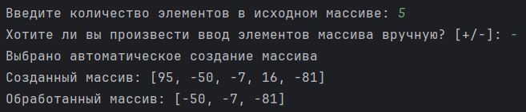
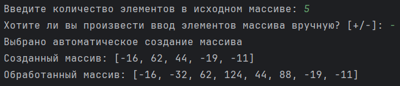
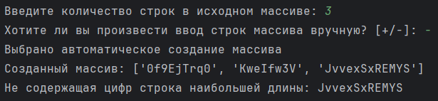
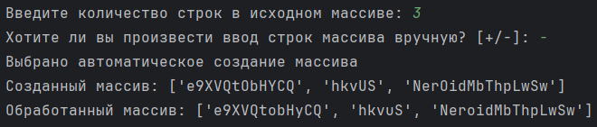

# Лабораторная работа №7. Списки (часть II)

> Написать 4 независимые программы (различных модулей - файлов исходного кода) для работы со списками, каждая из которых будет реализовывать ввод, соответствующее задание и вывод изменённого списка (кроме п.3):
> - (1). Удалить все элементы целочисленного списка, имеющие свойство по варианту, за один цикл.
> - (2). После каждого элемента целочисленного списка, имеющего свойство по варианту, добавить его удвоенное значение, без использования вложенных циклов.
> - (3). Поиск элемента в списке строк по варианту.
> - (4). Изменение элемента в списке строк по варианту

## Информация о работе
> - **Вариант:** 
>   - (1). Удаление всех положительных элементов массива
>   - (2). Добавление в массив соседних удвоенных значений всех четных элементов
>   - (3). Поиск не содержащей цифр строки наибольшей длины
>   - (4). Замена всех заглавных гласных букв в строках на строчные
> - **Язык программирования:** Python
> - **Среда разработки:** Pycharm Community Edition

## Описание работы

| Файл                                                                                                                           | Описание                            |
|:-------------------------------------------------------------------------------------------------------------------------------|:------------------------------------|
| [task_1.py](https://github.com/Kori-Tamashi/bmstu/blob/first_semester/first_semester/programming/lab_07/code/task_1.py)        | Программа 1                         |
| [task_2.py](https://github.com/Kori-Tamashi/bmstu/blob/first_semester/first_semester/programming/lab_07/code/task_2.py)        | Программа 2                         |
| [task_3.py](https://github.com/Kori-Tamashi/bmstu/blob/first_semester/first_semester/programming/lab_07/code/task_3.py)        | Программа 3                         |
| [task_4.py](https://github.com/Kori-Tamashi/bmstu/blob/first_semester/first_semester/programming/lab_07/code/task_1.py)        | Программа 4                         |
| [config.py](https://github.com/Kori-Tamashi/bmstu/blob/first_semester/first_semester/programming/lab_07/code/config.py)        | Файл, содержащий константы          |
| [lab_07.pdf](https://github.com/Kori-Tamashi/bmstu/blob/first_semester/first_semester/programming/lab_07/documents/lab_07.pdf) | Файл c заданием лабораторной работы |

### Последовательность выполнения

#### Программа 1

> Программа начинается с импорта необходимых библиотек и конфигурационного файла config.py. Затем происходит ввод количества элементов массива с проверкой на положительность, где переменная n запрашивается в цикле до тех пор, пока пользователь не введет корректное значение. Если ввод некорректен, выводится сообщение об ошибке, хранящееся в pint_inpt_err_msg. Далее программа запрашивает у пользователя, хочет ли он вручную вводить элементы массива, и результат сохраняется в переменной is_manual_input. Если выбран ручной ввод, программа информирует об этом, иначе сообщает о автоматическом создании массива. Массив arr инициализируется нулями длиной n. В случае ручного ввода программа запрашивает каждый элемент массива в цикле, обрабатывая ошибки ввода. Если автоматический ввод выбран, массив заполняется случайными числами в заданном диапазоне, определяемом переменными min_element и max_element. После создания массива выводится его содержимое. Затем начинается обработка массива, где выполняется обратный проход по элементам. Если элемент положительный, он удаляется из массива с помощью оператора del. В конце выводится обработанный массив, который содержит только неположительные элементы.

#### Программа 2

> Программа начинается с импорта необходимых библиотек и конфигурационного файла config.py. После этого происходит ввод количества элементов массива, где переменная n запрашивается в цикле до тех пор, пока пользователь не введет положительное значение. Если ввод некорректен, выводится сообщение об ошибке из pint_inpt_err_msg. Затем программа спрашивает пользователя, хочет ли он вручную вводить элементы массива, и результат сохраняется в переменной is_manual_input. Если выбран ручной ввод, программа информирует об этом, в противном случае сообщает о автоматическом создании массива. Массив arr инициализируется нулями длиной n. При ручном вводе программа запрашивает каждый элемент массива в цикле, обрабатывая возможные ошибки ввода. Если выбран автоматический ввод, массив заполняется случайными числами в заданном диапазоне, определяемом переменными min_element и max_element. После создания массива выводится его содержимое. Затем начинается обработка массива: с помощью цикла while программа проходит по всем элементам массива. Если элемент четный, в массив добавляется удвоенное значение этого элемента сразу после него с помощью метода insert, и индекс увеличивается на 1, чтобы пропустить только что добавленный элемент. Индекс i также увеличивается на 1 для перехода к следующему элементу. В конце выводится обработанный массив, который содержит исходные элементы и соседние удвоенные значения всех четных элементов.

#### Программа 3

> Программа начинается с импорта необходимых библиотек и конфигурационного файла config.py. Ввод количества строк массива осуществляется в цикле, где переменная n запрашивается до тех пор, пока пользователь не введет положительное значение. При некорректном вводе выводится сообщение об ошибке из pint_inpt_err_msg. Далее программа спрашивает пользователя, хочет ли он вручную вводить строки массива, и результат сохраняется в переменной is_manual_input. Если выбран ручной ввод, программа сообщает об этом, в противном случае уведомляет о автоматическом создании массива. Массив arr инициализируется пустыми строками длиной n. При ручном вводе программа запрашивает каждую строку массива в цикле. Если выбран автоматический ввод, массив заполняется случайными строками, длина которых генерируется случайным образом в диапазоне от min_length до max_length. Строки формируются из случайных букв и цифр, используя символы из string.ascii_letters и string.digits. После создания массива выводится его содержимое. Затем начинается поиск строки наибольшей длины, не содержащей цифр: программа проходит по всем строкам массива, проверяя, содержит ли каждая строка цифры с помощью функции any и метода isdigit. Если строка не содержит цифр и её длина больше текущей максимальной длины, она сохраняется в переменной max_str. В конце выводится результат: если max_str не пустая, программа показывает найденную строку, иначе сообщает, что все строки содержат цифры.

#### Программа 4

> Программа начинается с импорта необходимых библиотек и конфигурационного файла config.py. Ввод количества строк массива осуществляется в цикле, где переменная n запрашивается до тех пор, пока пользователь не введет положительное значение. При некорректном вводе выводится сообщение об ошибке из pint_inpt_err_msg. Затем программа спрашивает пользователя, хочет ли он вручную вводить строки массива, и результат сохраняется в переменной is_manual_input. Если выбран ручной ввод, программа уведомляет об этом, в противном случае сообщает о автоматическом создании массива. Массив arr инициализируется пустыми строками длиной n. При ручном вводе программа запрашивает каждую строку массива в цикле. Если выбран автоматический ввод, массив заполняется случайными строками, длина которых генерируется случайным образом в диапазоне от min_length до max_length. Строки формируются из случайных букв и цифр, используя символы из string.ascii_letters и string.digits. После создания массива выводится его содержимое. Затем начинается обработка массива, где каждая строка проходит через цикл, и все заглавные гласные буквы (определяемые в переменной VOWELS) заменяются на строчные с помощью генератора списков и метода lower. Обработанные строки сохраняются обратно в массив. В конце выводится обработанный массив с измененными строками.

### Особенности выполнения

#### Файл с константами

> Программа использует файл config.py для хранения констант, что позволяет централизовать настройки и упростить редактирование параметров, таких как минимальное и максимальное значения элементов массива при автоматическом заполнении, а также сообщения об ошибках для пользовательского ввода. Константы, такие как min_element и max_element, задают диапазон случайных чисел, используемых в массиве, что делает программу более гибкой и настраиваемой. Сообщения об ошибках, такие как int_inpt_err_msg, pint_inpt_err_msg и uint_inpt_err_msg, обеспечивают пользователю четкие указания по вводу данных, улучшая взаимодействие с программой и предотвращая возможные ошибки ввода. Использование отдельного файла для конфигурации также способствует лучшей организации кода и его повторному использованию в других проектах.

#### Названия переменных

> - [*int_inpt_err_msg*](https://github.com/Kori-Tamashi/bmstu/blob/first_semester/first_semester/programming/lab_07/code/config.py#L5) является сокращением от *int_input_error_message* (англ. сообщение об ошибке при вводе целого числа)
> - [*pint_inpt_err_msg*](https://github.com/Kori-Tamashi/bmstu/blob/first_semester/first_semester/programming/lab_07/code/config.py#L6) является сокращением от *positive_int_input_error_message* (англ. сообщение об ошибке при вводе натурального числа)
> - [*uint_inpt_err_msg*](https://github.com/Kori-Tamashi/bmstu/blob/first_semester/first_semester/programming/lab_07/code/config.py#L7) является сокращением от *unsigned_int_input_error_message* (англ. сообщение об ошибке при вводе неотрицательного целого числа)

### Примеры работы

|           Программа 1           |           Программа 2           |           Программа 3           |           Программа 4           |
|:-------------------------------:|:-------------------------------:|:-------------------------------:|:-------------------------------:|
|  |  |  |  |
