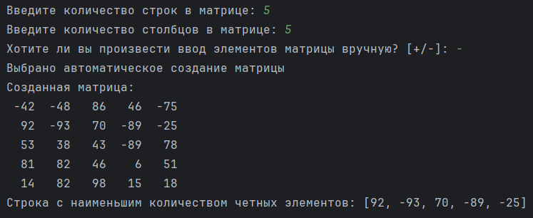
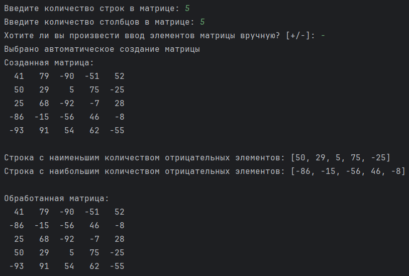
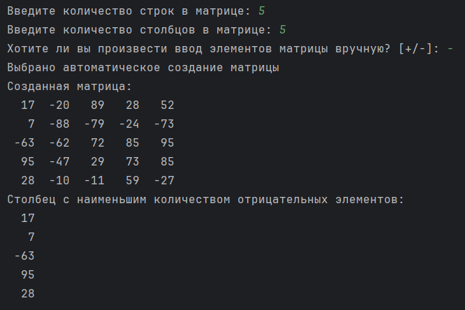
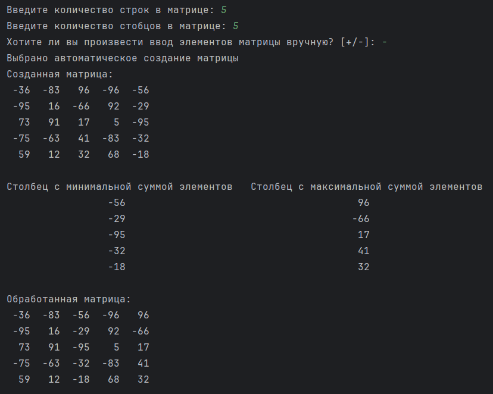
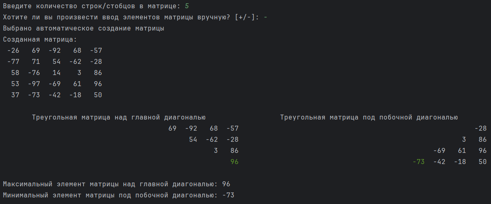
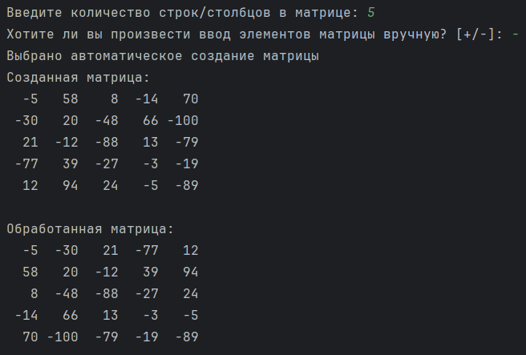

# Лабораторная работа №8. Матрицы (часть I)

> Написать 6 независимых программ (различных модулей - файлов исходного кода) для с матрицами, каждая из которых будет реализовывать ввод, печать исходной матрицы, соответствующее задание и вывод изменённой матрицы:
> - (1). Найти строку, имеющую определённое свойство по варианту.
> - (2). Переставить местами строки с наибольшим и наименьшим количеством отрицательных элементов.
> - (3). Найти столбец, имеющий определённое свойство по варианту.
> - (4). Переставить местами столбцы с максимальной и минимальной суммой элементов.
> - (5). Найти максимальное значение в квадратной матрице над главной диагональю и минимальное - под побочной диагональю.
> - (6). Выполнить транспонирование квадратной матрицы.

## Информация о работе
> - **Вариант:** 
>   - (1). Поиск строки с наименьшим количеством четных элементов
>   - (3). Поиск столбца с наименьшим количеством отрицательных элементов
> - **Язык программирования:** Python
> - **Среда разработки:** Pycharm Community Edition

## Описание работы

| Файл                                                                                                                           | Описание                            |
|:-------------------------------------------------------------------------------------------------------------------------------|:------------------------------------|
| [task_1.py](https://github.com/Kori-Tamashi/bmstu/blob/first_semester/first_semester/programming/lab_08/code/task_1.py)        | Программа 1                         |
| [task_2.py](https://github.com/Kori-Tamashi/bmstu/blob/first_semester/first_semester/programming/lab_08/code/task_2.py)        | Программа 2                         |
| [task_3.py](https://github.com/Kori-Tamashi/bmstu/blob/first_semester/first_semester/programming/lab_08/code/task_3.py)        | Программа 3                         |
| [task_4.py](https://github.com/Kori-Tamashi/bmstu/blob/first_semester/first_semester/programming/lab_08/code/task_4.py)        | Программа 4                         |
| [task_5.py](https://github.com/Kori-Tamashi/bmstu/blob/first_semester/first_semester/programming/lab_08/code/task_5.py)        | Программа 5                         |
| [task_6.py](https://github.com/Kori-Tamashi/bmstu/blob/first_semester/first_semester/programming/lab_08/code/task_6.py)        | Программа 6                         |
| [config.py](https://github.com/Kori-Tamashi/bmstu/blob/first_semester/first_semester/programming/lab_08/code/config.py)        | Файл, содержащий константы          |
| [lab_08.pdf](https://github.com/Kori-Tamashi/bmstu/blob/first_semester/first_semester/programming/lab_08/documents/lab_08.pdf) | Файл c заданием лабораторной работы |

### Последовательность выполнения

#### Программа 1

> Программа начинается с импорта необходимых библиотек и конфигурационного файла config.py. Ввод количества строк матрицы осуществляется в цикле, где переменная m запрашивается до тех пор, пока пользователь не введет положительное значение. При некорректном вводе выводится сообщение об ошибке из pint_inpt_err_msg. Затем программа аналогично запрашивает количество столбцов матрицы, сохраняя значение в переменной n. После этого программа спрашивает пользователя, хочет ли он вводить элементы матрицы вручную, и результат сохраняется в переменной is_manual_input. Если выбран ручной ввод, программа уведомляет об этом, в противном случае сообщает о автоматическом создании матрицы. Матрица matrix инициализируется нулями с размерами m на n. При ручном вводе программа запрашивает каждый элемент матрицы в двух вложенных циклах, пока не будет введено корректное целое число. Если выбран автоматический ввод, матрица заполняется случайными целыми числами в диапазоне от min_element до max_element. После создания матрицы выводится её содержимое в читаемом формате. Затем начинается поиск строки с наименьшим количеством четных элементов: программа проходит по всем строкам матрицы, подсчитывая количество четных элементов в каждой строке с помощью генератора списков и функции sum. Если количество четных элементов в текущей строке меньше минимального, обновляются переменные min_k и min_row_index. В конце выводится строка с наименьшим количеством четных элементов.

#### Программа 2

> Программа начинается с импорта необходимых библиотек и конфигурационного файла config.py. Ввод количества строк матрицы осуществляется в цикле, где переменная m запрашивается до тех пор, пока пользователь не введет положительное значение. При некорректном вводе выводится сообщение об ошибке из pint_inpt_err_msg. Аналогично запрашивается количество столбцов матрицы, сохраняя значение в переменной n. Затем программа спрашивает пользователя, хочет ли он вводить элементы матрицы вручную, и результат сохраняется в переменной is_manual_input. Если выбран ручной ввод, программа уведомляет об этом, в противном случае сообщает о автоматическом создании матрицы. Матрица matrix инициализируется нулями с размерами m на n. При ручном вводе программа запрашивает каждый элемент матрицы в двух вложенных циклах, пока не будет введено корректное целое число. Если выбран автоматический ввод, матрица заполняется случайными целыми числами в диапазоне от min_element до max_element. После создания матрицы выводится её содержимое. Затем начинается процесс перестановки местами строк с наибольшим и наименьшим количеством отрицательных элементов: программа проходит по всем строкам матрицы, подсчитывая количество отрицательных элементов в каждой строке с помощью генератора списков и функции sum. Если количество отрицательных элементов в текущей строке меньше минимального, обновляются переменные min_k и min_row_index. Если количество отрицательных элементов больше максимального, обновляются переменные max_k и max_row_index. После завершения цикла строки с наименьшим и наибольшим количеством отрицательных элементов меняются местами. В конце выводится строка с наименьшим и наибольшим количеством отрицательных элементов, а также обновленная матрица.

#### Программа 3

> Программа начинается с импорта необходимых библиотек и конфигурационного файла config.py. Затем происходит ввод количества строк матрицы в цикле, где переменная m запрашивается до тех пор, пока пользователь не введет положительное значение. При некорректном вводе выводится сообщение об ошибке из pint_inpt_err_msg. Аналогично запрашивается количество столбцов матрицы, сохраняя значение в переменной n. Далее программа спрашивает пользователя, хочет ли он вводить элементы матрицы вручную, и результат сохраняется в переменной is_manual_input. Если выбран ручной ввод, программа уведомляет об этом, в противном случае сообщает о автоматическом создании матрицы. Матрица matrix инициализируется нулями с размерами m на n. При ручном вводе программа запрашивает каждый элемент матрицы в двух вложенных циклах, пока не будет введено корректное целое число. Если выбран автоматический ввод, матрица заполняется случайными целыми числами в диапазоне от min_element до max_element. После создания матрицы выводится её содержимое. Затем начинается поиск столбца с наименьшим количеством отрицательных элементов: программа проходит по всем столбцам матрицы, подсчитывая количество отрицательных элементов в каждом столбце с помощью генератора списков и функции sum. Если количество отрицательных элементов в текущем столбце меньше минимального, обновляются переменные min_k и min_column_index. В конце выводится столбец с наименьшим количеством отрицательных элементов, отображая его элементы по строкам.

#### Программа 4

> Программа начинается с импорта необходимых библиотек и конфигурационного файла config.py. Затем происходит ввод количества строк матрицы в цикле, где переменная m запрашивается до тех пор, пока пользователь не введет положительное значение. При некорректном вводе выводится сообщение об ошибке из pint_inpt_err_msg. Аналогично запрашивается количество столбцов матрицы, сохраняя значение в переменной n. Далее программа спрашивает пользователя, хочет ли он вводить элементы матрицы вручную, и результат сохраняется в переменной is_manual_input. Если выбран ручной ввод, программа уведомляет об этом, в противном случае сообщает о автоматическом создании матрицы. Матрица matrix инициализируется нулями с размерами m на n. При ручном вводе программа запрашивает каждый элемент матрицы в двух вложенных циклах, пока не будет введено корректное целое число. Если выбран автоматический ввод, матрица заполняется случайными целыми числами в диапазоне от min_element до max_element. После создания матрицы выводится её содержимое. Затем начинается процесс перестановки местами столбцов с максимальной и минимальной суммой элементов: программа проходит по всем столбцам матрицы, вычисляя сумму элементов каждого столбца с помощью функции sum. Если сумма текущего столбца меньше минимальной, обновляются переменные min_sum и min_column_index. Если сумма больше максимальной, обновляются переменные max_sum и max_column_index. После этого элементы столбцов с минимальной и максимальной суммой меняются местами для каждой строки матрицы. В конце выводится информация о столбцах с минимальной и максимальной суммой элементов, а также обновленная матрица. 

#### Программа 5

> Программа начинается с импорта необходимых библиотек и конфигурационного файла config.py. Затем происходит ввод количества строк и столбцов матрицы, где переменная m запрашивается в цикле до тех пор, пока пользователь не введет положительное значение. При некорректном вводе выводится сообщение об ошибке из pint_inpt_err_msg. Далее программа спрашивает пользователя, хочет ли он вводить элементы матрицы вручную, и результат сохраняется в переменной is_manual_input. Если выбран ручной ввод, программа уведомляет об этом, в противном случае сообщает о автоматическом создании матрицы. Матрица matrix инициализируется нулями с размерами m на m. При ручном вводе программа запрашивает каждый элемент матрицы в двух вложенных циклах, пока не будет введено корректное целое число. Если выбран автоматический ввод, матрица заполняется случайными целыми числами в диапазоне от min_element до max_element. После создания матрицы выводится её содержимое. Затем начинается поиск максимального элемента матрицы над главной диагональю: программа проходит по элементам, находящимся выше главной диагонали, и обновляет переменную max_elem, если текущий элемент больше. Аналогично, программа ищет минимальный элемент под побочной диагональю, проходя по соответствующим элементам и обновляя переменную min_elem. После этого выводится информация о треугольной матрице над главной диагональю и под побочной диагональю, где максимальный и минимальный элементы выделяются зеленым цветом. В конце выводится максимальный элемент матрицы над главной диагональю и минимальный элемент матрицы под побочной диагональю.

#### Программа 6

> Программа начинается с импорта необходимых библиотек и конфигурационного файла config.py. Затем осуществляется ввод количества строк и столбцов матрицы, где переменная m запрашивается в цикле до тех пор, пока пользователь не введет положительное значение. При некорректном вводе выводится сообщение об ошибке из pint_inpt_err_msg. Далее программа спрашивает пользователя, хочет ли он вводить элементы матрицы вручную, и результат сохраняется в переменной is_manual_input. Если выбран ручной ввод, программа уведомляет об этом, в противном случае сообщает о автоматическом создании матрицы. Матрица matrix инициализируется нулями с размерами m на m. При ручном вводе программа запрашивает каждый элемент матрицы в двух вложенных циклах, пока не будет введено корректное целое число. Если выбран автоматический ввод, матрица заполняется случайными целыми числами в диапазоне от min_element до max_element. После создания матрицы выводится её содержимое. Затем начинается обработка матрицы для её транспонирования: программа проходит по элементам матрицы в двух вложенных циклах и меняет местами элементы с индексами (i, j) и (j, i). В конце выводится обработанная матрица, которая является транспонированной версией исходной.

### Особенности выполнения

#### Файл с константами

> Программа использует файл config.py для хранения констант, что позволяет централизовать настройки и упростить редактирование параметров, таких как минимальное и максимальное значения элементов массива при автоматическом заполнении, а также сообщения об ошибках для пользовательского ввода. Константы, такие как min_element и max_element, задают диапазон случайных чисел, используемых в массиве, что делает программу более гибкой и настраиваемой. Сообщения об ошибках, такие как int_inpt_err_msg, pint_inpt_err_msg и uint_inpt_err_msg, обеспечивают пользователю четкие указания по вводу данных, улучшая взаимодействие с программой и предотвращая возможные ошибки ввода. Использование отдельного файла для конфигурации также способствует лучшей организации кода и его повторному использованию в других проектах.

#### Названия переменных

> - [*int_inpt_err_msg*](https://github.com/Kori-Tamashi/bmstu/blob/first_semester/first_semester/programming/lab_08/code/config.py#L3) является сокращением от *int_input_error_message* (англ. сообщение об ошибке при вводе целого числа)
> - [*pint_inpt_err_msg*](https://github.com/Kori-Tamashi/bmstu/blob/first_semester/first_semester/programming/lab_08/code/config.py#L4) является сокращением от *positive_int_input_error_message* (англ. сообщение об ошибке при вводе натурального числа)
> - [*uint_inpt_err_msg*](https://github.com/Kori-Tamashi/bmstu/blob/first_semester/first_semester/programming/lab_08/code/config.py#L5) является сокращением от *unsigned_int_input_error_message* (англ. сообщение об ошибке при вводе неотрицательного целого числа)

### Примеры работы

|           Программа 1           |           Программа 2           |           Программа 3           |           Программа 4           |           Программа 5           |           Программа 6           |
|:-------------------------------:|:-------------------------------:|:-------------------------------:|:-------------------------------:|:-------------------------------:|:-------------------------------:|
|  |  |  |  |  |  |
