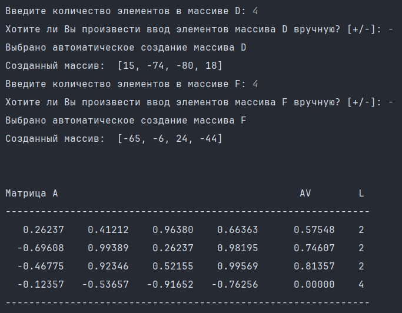
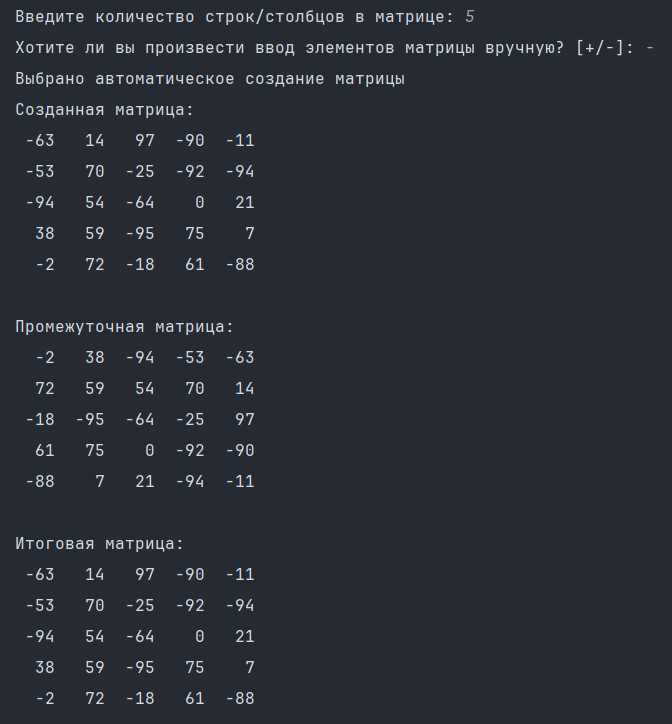
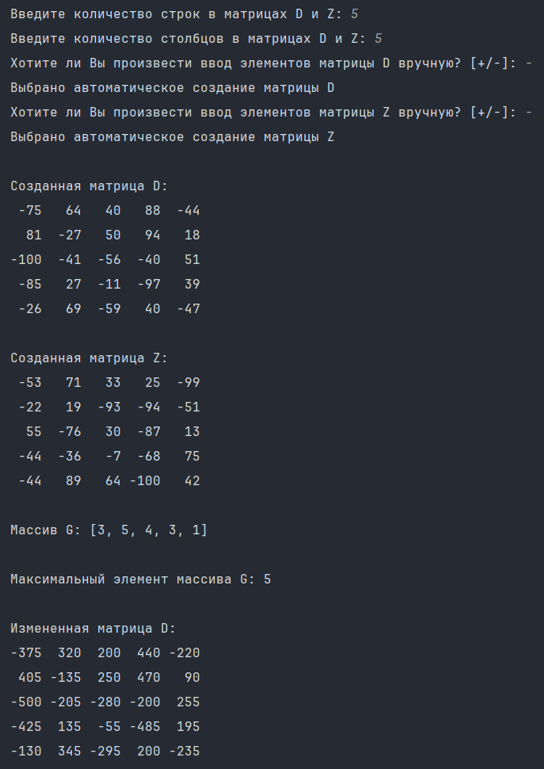
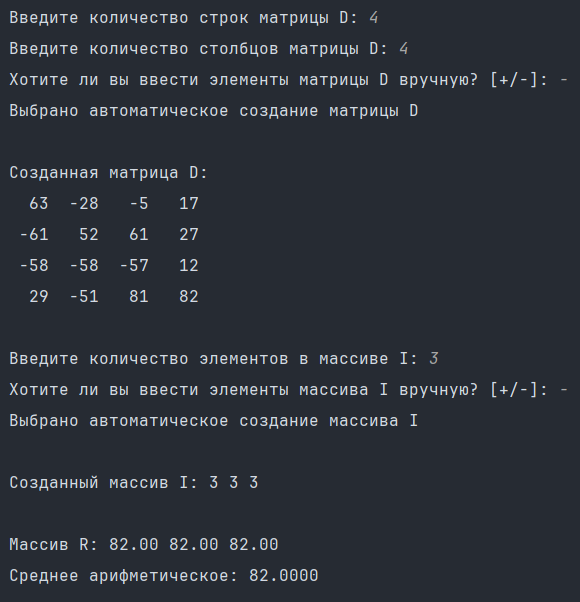
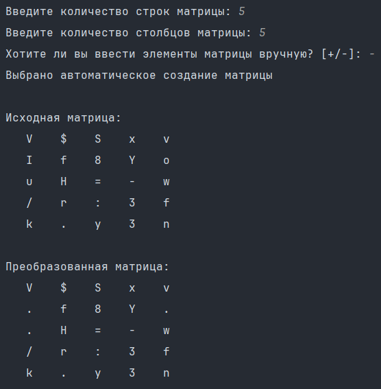
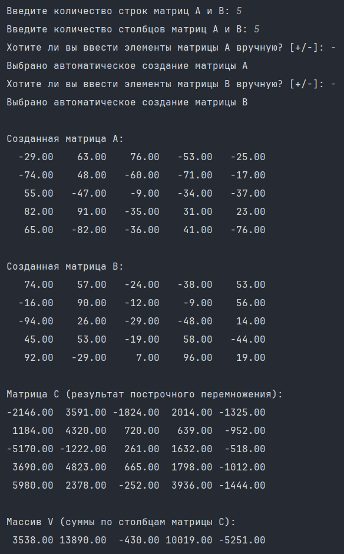
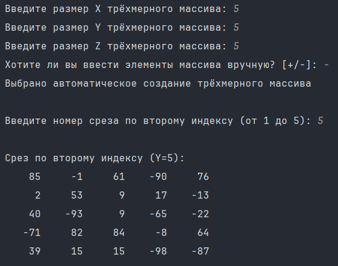

# Лабораторная работа №9. Матрицы (часть II)

> Написать 7 независимых программ (различных модулей - файлов исходного кода) для работы с матрицами, каждая из которых будет реализовывать:
> - (1). Формирование матрицы по формуле, вычисление среднего арифметического положительных чисел каждой строки и количества элементов, меньших среднего.
> - (2). Поворот квадратной целочисленной матрицы на 90° по часовой стрелке, затем на 90° против часовой стрелки.
> - (3). Подсчет в каждой строке матрицы количества элементов, превышающих суммы элементов соответствующих строк другой матрицы.
> - (4). Поиск максимальных элементов в строках матрицы по заданным номерам строк и вычисление их среднего арифметического.
> - (5). Замена гласных английских букв в матрице символов на точки.
> - (6). Построчное перемножение матриц одинаковой размерности и вычисление сумм элементов в столбцах результирующей матрицы.
> - (7). Вывод i-го среза (матрицы) трёхмерного массива по второму индексу.

## Информация о работе
> - **Вариант:** не указан (в задании вариантов нет)
> - **Язык программирования:** Python
> - **Среда разработки:** Pycharm Community Edition

## Описание работы

| Файл                                                                                                                           | Описание                                                                 |
|:-------------------------------------------------------------------------------------------------------------------------------|:-------------------------------------------------------------------------|
| [task_1.py](https://github.com/Kori-Tamashi/bmstu/blob/first_semester/first_semester/programming/lab_09/code/task_1.py)                  | Программа 1: Формирование матрицы по формуле                             |
| [task_2.py](https://github.com/Kori-Tamashi/bmstu/blob/first_semester/first_semester/programming/lab_09/code/task_2.py)                  | Программа 2: Поворот квадратной матрицы                                  |
| [task_3.py](https://github.com/Kori-Tamashi/bmstu/blob/first_semester/first_semester/programming/lab_09/code/task_3.py)                  | Программа 3: Сравнение элементов матрицы с суммами строк                |
| [task_4.py](https://github.com/Kori-Tamashi/bmstu/blob/first_semester/first_semester/programming/lab_09/code/task_4.py)                  | Программа 4: Поиск максимальных элементов в заданных строках            |
| [task_5.py](https://github.com/Kori-Tamashi/bmstu/blob/first_semester/first_semester/programming/lab_09/code/task_5.py)                  | Программа 5: Замена гласных букв на точки                               |
| [task_6.py](https://github.com/Kori-Tamashi/bmstu/blob/first_semester/first_semester/programming/lab_09/code/task_6.py)                  | Программа 6: Построчное перемножение матриц                             |
| [task_7.py](https://github.com/Kori-Tamashi/bmstu/blob/first_semester/first_semester/programming/lab_09/code/task_7.py)                  | Программа 7: Работа с трёхмерным массивом                               |
| [config.py](https://github.com/Kori-Tamashi/bmstu/blob/first_semester/first_semester/programming/lab_09/code/config.py)                  | Файл, содержащий константы                                              |
| [lab_09.pdf](https://github.com/Kori-Tamashi/bmstu/blob/first_semester/first_semester/programming/lab_09/documents/lab_09.pdf)           | Файл c заданием лабораторной работы                                     |

### Последовательность выполнения

#### Программа 1
> Программа начинается с импорта необходимых библиотек и конфигурационного файла config.py. Ввод размеров массивов D и F осуществляется в циклах с проверкой корректности ввода. Пользователю предоставляется выбор между ручным и автоматическим заполнением массивов. Матрица A формируется по формуле a[j][k] = sin(D[j] + F[k]). Для каждой строки матрицы вычисляется среднее арифметическое положительных чисел (массив AV) и количество элементов, меньших этого среднего (массив L). Результаты выводятся в виде форматированной таблицы, где матрица A представлена с точностью до 5 знаков после запятой, а массивы AV и L выводятся рядом.

#### Программа 2
> Программа запрашивает размер квадратной матрицы и предлагает выбор между ручным и автоматическим заполнением. После вывода исходной матрицы выполняется поворот на 90° по часовой стрелке с использованием алгоритма замены элементов "на месте" без дополнительных матриц. Выводится промежуточная матрица. Затем выполняется обратный поворот на 90° против часовой стрелки, также без дополнительных матриц. Фиксируется итоговая матрица, которая должна совпадать с исходной.

#### Программа 3
> Программа вводит размеры матриц D и Z, предлагая для каждой отдельный выбор режима заполнения. После вывода обеих матриц вычисляются суммы элементов каждой строки матрицы Z. Для каждой строки матрицы D подсчитывается количество элементов, превышающих сумму соответствующей строки матрицы Z (массив G). Матрица D умножается на максимальный элемент массива G. Результаты выводятся, включая массив G и преобразованную матрицу D.

#### Программа 4
> Программа запрашивает размеры матрицы D и предлагает выбор режима её заполнения. После вывода матрицы D пользователь вводит количество элементов в массиве I (номера строк) и выбирает режим его заполнения. Для каждой указанной строки находится максимальный элемент (массив R). Вычисляется среднее арифметическое значений массива R. Результаты включают исходную матрицу D, массивы I и R, а также среднее значение.

#### Программа 5
> Программа вводит размеры матрицы символов и предлагает выбор режима заполнения. При ручном вводе проверяется, что вводится ровно один символ. Автоматическое заполнение использует случайные символы из заданного набора. Выводится исходная матрица, затем создаётся копия, где все гласные английские буквы (a, e, i, o, u, A, E, I, O, U) заменяются на точки. Преобразованная матрица выводится в том же формате, что и исходная.

#### Программа 6
> Программа запрашивает одинаковые размеры для матриц A и B. Для каждой матрицы отдельно предлагается выбор режима заполнения. После вывода обеих матриц создаётся матрица C путём построчного перемножения соответствующих элементов матриц A и B. Затем вычисляется массив V - суммы элементов каждого столбца матрицы C. Результаты включают матрицы A, B, C и массив V, все выводятся с форматированием чисел.

#### Программа 7
> Программа вводит размеры трёхмерного массива (X, Y, Z) и предлагает выбор режима заполнения. После создания массива запрашивается номер среза по второму индексу (от 1 до Y). Формируется матрица-срез размером X×Z путём фиксации второго индекса. Ширина столбцов вывода динамически рассчитывается на основе экстремальных значений элементов.

### Особенности выполнения

#### Файл с константами
> Файл [config.py](https://github.com/Kori-Tamashi/bmstu/blob/first_semester/first_semester/programming/lab_09/code/config.py) содержит:
> - Диапазоны значений для автоматического заполнения (`min_element`, `max_element`)
> - Сообщения об ошибках ввода (`int_inpt_err_msg`, `float_inpt_err_msg` и др.)
> - Визуальные элементы форматирования (`separator`, `green_start` и др.)

#### Единый стиль программ
> Все программы имеют одинаковую структуру:
> 1. Защищённый ввод параметров с проверкой и обработкой ошибок
> 2. Выбор режима заполнения данных (ручной/автоматический)
> 3. Форматированный вывод исходных данных

### Примеры работы

|           Программа 1           |           Программа 2           |           Программа 3           |           Программа 4           |
|:-------------------------------:|:-------------------------------:|:-------------------------------:|:-------------------------------:|
|  |  |  |  |

|           Программа 5           |           Программа 6           |           Программа 7           |
|:-------------------------------:|:-------------------------------:|:-------------------------------:|
|  |  |  |