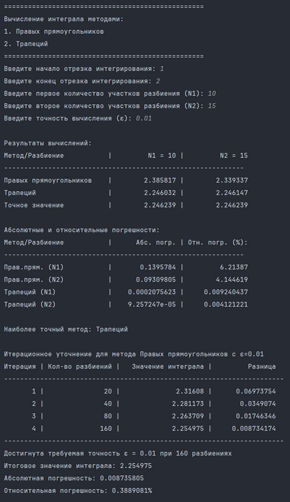

# Лабораторная работа №10. Вычисление приближённого значения интеграла

> Написать программу для вычисления приближённого значения интеграла известной функции двумя разными методами. Программа должна позволять задать начало и конец отрезка интегрирования, а также N1 и N2 - количества участков разбиения. После вычислений требуется определить наиболее точный метод, вычислить абсолютную и относительную погрешности, а для менее точного метода итерационно вычислить количество участков разбиения для достижения заданной точности.

## Информация о работе
> - **Вариант:** 
>   - 1-й метод: правых прямоугольников
>   - 2-й метод: трапеций
> - **Язык программирования:** Python
> - **Среда разработки:** Pycharm Community Edition

## Описание работы

| Файл                                                                                                                           | Описание                                                                 |
|:-------------------------------------------------------------------------------------------------------------------------------|:-------------------------------------------------------------------------|
| [main.py](https://github.com/Kori-Tamashi/bmstu/blob/first_semester/first_semester/programming/lab_10/code/main.py)            | Главный файл программы                                                  |
| [config.py](https://github.com/Kori-Tamashi/bmstu/blob/first_semester/first_semester/programming/lab_10/code/config.py)        | Файл, содержащий константы и сообщения об ошибках                       |
| [lab_10.pdf](https://github.com/Kori-Tamashi/bmstu/blob/first_semester/first_semester/programming/lab_10/documents/lab_10.pdf) | Файл c заданием лабораторной работы                                     |

### Последовательность выполнения

> Программа начинается с импорта необходимых библиотек и конфигурационного файла config.py. Затем выводится заголовок с описанием методов интегрирования. 

> Ввод параметров осуществляется с проверкой корректности:
> 1. Начало и конец отрезка интегрирования (a, b) с проверкой, что a < b
> 2. Два количества участков разбиения (N1, N2) с проверкой положительности
> 3. Точность вычислений (ε) с проверкой положительности

> Затем программа вычисляет:
> 1. Точное значение интеграла через первообразную F(x)
> 2. Приближенные значения методами правых прямоугольников и трапеций для N1 и N2
> 3. Абсолютные и относительные погрешности для всех вычислений

> Результаты выводятся в виде таблиц:
> 1. Таблица с результатами интегрирования разными методами
> 2. Таблица с абсолютными и относительными погрешностями

> На основе погрешностей определяется наиболее точный метод. Для менее точного метода запускается итерационный процесс уточнения с удвоением количества разбиений на каждой итерации до достижения заданной точности |I(N) - I(2N)| < ε. 

> Процесс итераций отображается в таблице с колонками: Итерация, Кол-во разбиений, Значение интеграла, Разница. В конце выводится итоговое значение интеграла с достигнутой точностью и погрешностями.

### Особенности выполнения

#### Обработка особых случаев
> 1. **Деление на ноль при вычислении относительной погрешности**: 
   > - При точном значении интеграла 0 относительная погрешность не вычисляется
   > - Добавлена проверка `abs(exact_value) > 1e-15` для избежания ошибок
> 2. **Симметричные интервалы интегрирования**:
   > - Для нечетных функций на симметричных интервалах точное значение = 0
   > - Программа корректно обрабатывает этот случай
> 3. **Эффективность итерационного процесса**:
   > - Начинается с минимального из N1/N2 для экономии вычислений
   > - На каждой итерации количество разбиений удваивается
   > - Вывод промежуточных результатов позволяет отслеживать сходимость

#### Файл с константами
> Файл [config.py](https://github.com/Kori-Tamashi/bmstu/blob/first_semester/first_semester/programming/lab_10/code/config.py) содержит:
> - Сообщения об ошибках ввода (`float_inpt_err_msg`, `pint_inpt_err_msg`)
> - Диапазоны значений для автоматического тестирования
> - Визуальные элементы форматирования

### Пример работы
|        Работа программы         |
|:-------------------------------:|
|  |