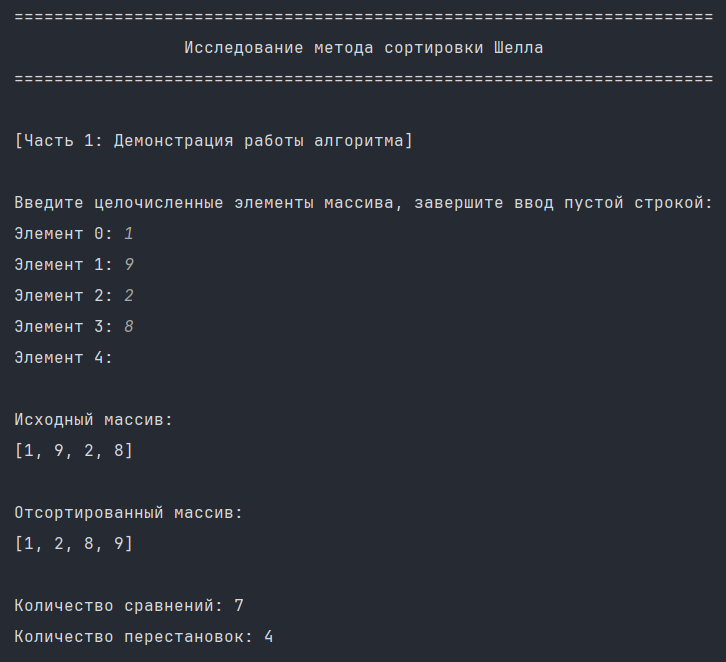
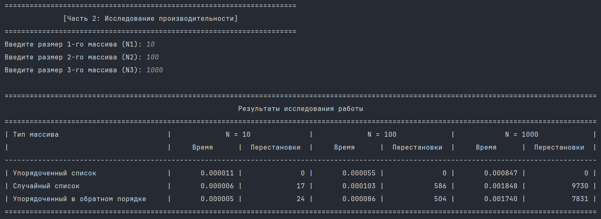

# Лабораторная работа №11. Исследование методов сортировки  

> Написать программу для демонстрации работы метода сортировки (метод Шелла) на примере массива целых чисел. Программа состоит из двух частей:  
> - (1) Сортировка пользовательского массива с выводом результатов  
> - (2) Исследование производительности на трёх размерах массивов (N1, N2, N3) и трёх типах данных (упорядоченный, случайный, обратно упорядоченный) с замером времени и перестановок.  

## Информация о работе  
> - **Вариант:** метод Шелла  
> - **Язык программирования:** Python  
> - **Среда разработки:** Pycharm Community Edition  

## Описание работы  

| Файл                                                                                                                                  | Описание                                                                |  
|:--------------------------------------------------------------------------------------------------------------------------------------|:------------------------------------------------------------------------|  
| [main.py](https://github.com/Kori-Tamashi/bmstu/blob/first_semester/first_semester/programming/lab_11/code/main.py)                   | Главный файл программы                                                  |  
| [config.py](https://github.com/Kori-Tamashi/bmstu/blob/first_semester/first_semester/programming/lab_11/code/config.py)               | Файл с константами и сообщениями об ошибках                             |  
| [lab_11.pdf](https://github.com/Kori-Tamashi/bmstu/blob/first_semester/first_semester/programming/lab_11/documents/lab_11.pdf)        | Файл c заданием лабораторной работы                                     |  

### Последовательность выполнения  

> Программа начинается с импорта необходимых библиотек и конфигурационного файла config.py. Выводится заголовок исследования. Часть 1: Пользователь вводит массив вручную (подтверждение пустой строкой). Программа выводит исходный массив, сортирует его методом Шелла с подсчётом сравнений и перестановок, выводит отсортированный массив и метрики. Часть 2: Пользователь вводит три размера массивов (N1, N2, N3). Для каждого размера генерируются три типа массивов: упорядоченный, случайный, обратный. Для каждого массива замеряется время сортировки и количество перестановок. Результаты выводятся в виде форматированной таблицы с колонками: Тип массива, Время (N1), Перестановки (N1), Время (N2), Перестановки (N2), Время (N3), Перестановки (N3).

### Особенности выполнения  

#### Файл с константами  
> Файл [config.py](https://github.com/Kori-Tamashi/bmstu/blob/first_semester/first_semester/programming/lab_11/code/config.py) содержит:  
> - `min_element = -1000`, `max_element = 1000` (диапазон генерации)  
> - `int_inpt_err_msg`, `pint_inpt_err_msg` (сообщения об ошибках)

### Пример работы  
|         Демонстрация работы алгоритма          |             Исследование производительности              |  
|:---------------------------------------------------:|:-----------------------------------------------------:|  
|  |  |  